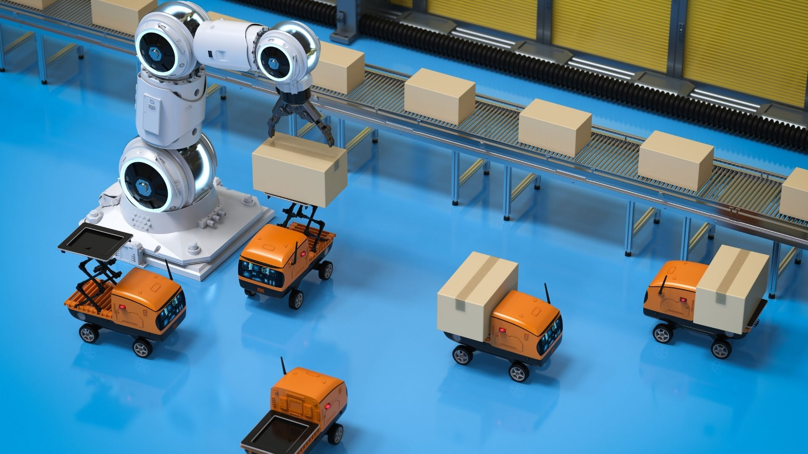

> Replacing tough human labor with robotics and automation drastically improved the ensured safety from agriculture, logistics to health, and manufacturing. 

Robots have been very successful in many applications due to their high endurance, speed, and precision in structured environments. However, there are some challenges in robotics.
Effectiveness of the robotics systems is limited by:

- embedded controller units
- onboard computers
- memory units
- storage space
- flexibility: once designed, it is hard to change or upgrade the platform

These facts are narrow down the upper limit of robotics technology. Yet, combining robotics with cloud computing can eliminate the barriers of robotics. This new branch of robotics, named cloud robotics, is the use of cloud computing resources to enable **greater computational power, memory, data-intensive learning, and interconnectivity** for robotics applications.

Benefits of cloud robotics:
- powerful computation on CPUs and GPUs
- high amount of storage
- time-sensitive networking over 5G communication

## Cloud-Native Robotics

Cloud robotics allows robots to share computation resources, information, and data with each other, and to access new knowledge and skills not learned by themselves. This opens a new paradigm in robotics that we believe leads to exciting future developments.

robolaunch’s goal is to initiate developments of cloud-native robotics. By offering a cloud robotics platform integrated with a wide range of cloud tools, you can develop cutting-edge robotics applications with the power of cloud computing. 

## robolaunch suggest you:

- Containerize your robotics software stack.
- Orchestrate over Kubernetes as so-called pods. Compiled containers can be deployed as pods in Kubernetes clusters by writing a description file called the YAML file.